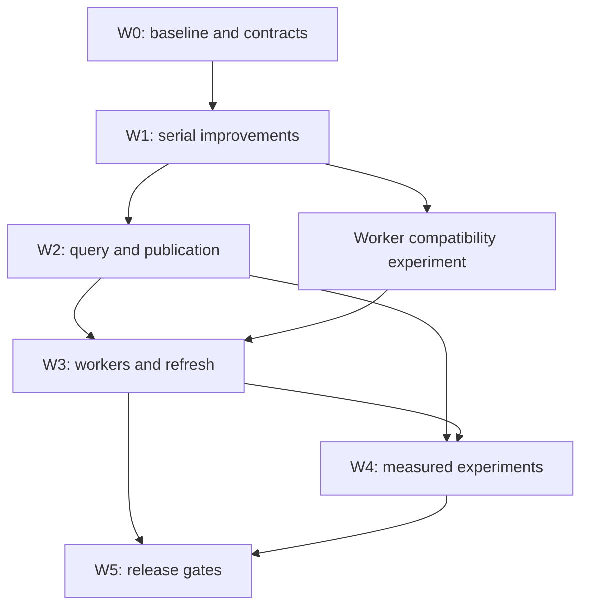

# Graft TypeScript performance implementation plan

**Status:** proposed, ready for technical review and staged execution.\
**Date:** 2026-09-15; source audit started 2026-09-14.\
**Baseline:** Graft v0.18.0, commit `f9e65396e638e517aecae0d731017f53084d70ed`.\
**Companion:** [Graft_TypeScript_Performance_Design.md](Graft_TypeScript_Performance_Design.md).\
**Scope:** improve the existing TypeScript/Node implementation while preserving its features, supported languages, output contracts, and existing extraction fidelity. No Rust rewrite, grammar replacement, or new language support is included.

This document specifies work to perform; it does not report completed changes. No performance benchmark was run to establish speedups for this proposal. Numerical thresholds below are proposed acceptance criteria, to be ratified after W0 measurements. Source comments containing historical timings are useful leads, not independent measurements on the user's workloads.

## 1. Execution principles

1. Establish reference behaviour and representative performance measurements before changing algorithms.
2. Prefer elimination of repeated work and unnecessary allocations before concurrency. A faster serial path reduces the memory cost and complexity of every later worker.
3. Preserve content correctness. An explicit build must still read and hash each supported source using the existing decoded-source semantics. A size/mtime shortcut cannot decide extraction reuse during an explicit build.
4. Keep production implementation, test helpers, benchmark drivers, and fixture generators in TypeScript or existing Node JavaScript conventions. Use `node:test` and `tsx`; introduce no Python framework or benchmark runner.
5. Retain existing refresh locks, stale-lock recovery, checkpoints, and `graphOnly` behaviour. New caches and concurrency controls extend these mechanisms.
6. Optimize one observable bottleneck per reviewable change. Each change carries its own correctness result, performance comparison, and rollback point.
7. Separate experimental optimizations from defaults. Reject an experiment that cannot preserve externally visible ordering, ranking, supported language behaviour, or resource bounds.

## 2. Contracts frozen before work begins

The integration owner records the baseline commit and freezes the following contracts in W0. Any intended semantic change becomes separate product work rather than being concealed inside a performance pull request.

Freeze the P03 preparation/invalidation interfaces and P08A publication identities here as contracts only. Within W2, implement P08A safeguards before enabling persistent P03 preparation caches; P03 may be developed concurrently behind a disabled gate.

| Area | Required preservation |
|---|---|
| Extraction and resolution | Supported extension inventory; native, generic WASM, and Vue container routes; node IDs, ordinals, kinds, spans, signatures, body hashes, raw-edge ownership, edge deduplication, scopes, language labels, and resolver decisions. |
| Source handling | Existing UTF-8 and UTF-16 handling; CRLF behaviour; Unicode offsets; unsupported-encoding skips; malformed-file errors; same-size edits with unchanged timestamps. Hash the same decoded string consumed by extraction. |
| Query behaviour | Regex syntax and errors, case handling, prefix filters, sorting and tie breaks, graph traversal depth, evidence, file diversity, rankings, scores, MCP payloads, and CLI formatting. |
| Persistence | Existing graph/read compatibility, paid-for summary reuse, extraction-cache purity, checkpoint recovery, sidecar fallback, concept cards, index and covers, worktree seeding, and graceful failures. |
| Refresh and workspace | Query freshness guard, explicit cache invalidation, lock ownership, directory selection, nested repositories, submodules, custom context directories, and per-workspace isolation. |
| Product surface | CLI flags, aliases, exit codes, public JavaScript API, hooks and installation flows, MCP tools, viewer interactions, App processing, and optional LSP/deep operations. |

Create differential snapshots using baseline and candidate executables in separate processes. Compare returned objects and deterministic serialized outputs directly. Exclude only specific documented nondeterministic fields, such as measured duration, when they actually occur. Do not sort every array or round every floating-point value to hide mismatches. Graph order can affect ordinals and retrieval, so array normalization requires explicit evidence that the field is unordered.

## 3. Team, ownership, and coordination

Use one integration owner and two to four concurrent implementation agents once contracts stabilize. Humans review contracts, correctness failures, and performance evidence. Agent count is a throughput aid, not a divisor applied to the schedule.

Roles:

- **Integration owner:** controls shared interfaces, package scripts, dependency changes, merge order, release gates, and the baseline/candidate comparison.
- **Build/extraction agent:** source lifecycle, extraction algorithms, build memory, and later parse-worker integration.
- **Query agent:** reusable graph views, prepared query data, ranking experiments, and cache invalidation.
- **Surface/integration agent:** projection writes, viewer efficiency, deep-provider behaviour, and App queue work when file ownership permits.
- **Verification agent:** benchmark harness, fixture expansion, fault injection, and independent review. This agent can work alongside implementation without editing its production files.

These are responsibilities, not mandatory model names. Select available models in the actual Codex CLI or herdr configuration. This plan deliberately supplies no unverified runner syntax or model identifiers.

### Exclusive file ownership

Every task packet lists exact owned files. Ownership includes review fixes until handoff is accepted. Reading another agent's files is allowed; editing them requires reassignment by the integration owner.

| Shared area | Owner and handoff rule |
|---|---|
| `package.json`, lockfile, `tsconfig.json`, CI workflow files, `scripts/run-tests.mjs` | Integration owner throughout; other agents submit a requested patch or describe the change. |
| `src/cli.ts` | P01 owner during lazy-import work; integration owner afterward. Later CLI wiring waits for an explicit handoff. |
| `src/graph/build.ts` | P05 owner first; publication coordinator for P08 groundwork next; P07 owner only after both handoffs. Never edited in parallel. |
| `src/graph/load.ts` | Query integration owner throughout P02/P03/P08. Feature agents implement separate modules and request loader hooks. |
| `src/graph/extract.ts`, `src/graph/generic.ts`, `src/graph/container.ts` | P04 owner first; P07 may edit only after extractor contracts and lifetime work merge. |
| `src/ask/index-file.ts` | P08 owner. P03 consumes its published types; P09 proposes changes through that owner. |
| `src/ask/ask.ts`, `src/ask/graphrank.ts` | Query agent; P03 lands before P09. |
| `src/graph/write.ts` | Publication coordinator. P06 focuses on cards/projections and requests any shared writer change. |
| `src/graph/refresh.ts`, workspace scheduling | P01 receives an initial import-only window; then hands the file back. P10 owns later scheduling after cache/publication contracts stabilize. |
| `src/mcp/tools.ts`, `src/viz/serve.ts` | Integration owner assigns narrow sequential wiring windows for graph-view and refresh consumers. |

Own new test files exclusively too. Additions to a single giant test file create the same merge conflict as production changes. Prefer focused new tests when they verify a distinct behavioural risk.

## 4. W0: baseline, profiling, and reference contracts

**Deliverables:** workload manifest, raw baseline results, parity snapshots, profile captures, contract inventory, and confirmed task ownership. W0 gates every later performance claim.

### 4.1 Establish reproducible checkouts

Known existing commands, from a normal development checkout:

```sh
git rev-parse HEAD
node --version
npm --version
npm ci
npm run build
npm test
node dist/cli.js --help
```

`npm ci` can run the repository's existing lifecycle scripts and native-addon installation. Record the actual lockfile and dependency resolution. If a platform cannot install a grammar, report that limitation rather than silently benchmarking a smaller language set.

Create a detached reference worktree and an isolated implementation branch with ordinary Git commands:

```sh
git worktree add --detach ../graft-perf-reference f9e65396e638e517aecae0d731017f53084d70ed
git worktree add -b perf/w0-contracts ../graft-perf-w0 f9e65396e638e517aecae0d731017f53084d70ed
```

For each later task, branch from the current accepted integration commit, not automatically from the original baseline. Never run reference and candidate against the same writable context directory. Keep the reference checkout immutable; store generated results outside it.

### 4.2 Benchmark harness

Propose a native TypeScript harness under `bench/performance/` with independent modules for workload setup, process execution, measurements, semantic comparison, and report generation. This is a proposed new path, not a claim that a harness already exists.

The harness must:

- Launch the compiled CLI with `process.execPath`; do not measure `tsx` startup as production CLI startup.
- Also exercise long-lived in-process/MCP scenarios, separating first request from subsequent requests.
- Record high-resolution wall duration and process CPU usage. Sample RSS during the workload and retain the process resource-usage high-water value when available, with units explicit.
- Measure CPU inside the benchmarked child or through an appropriate external process monitor; `process.cpuUsage()` in the launcher measures the launcher, not its CLI child. A child event-loop sampler can miss synchronous peaks, so use an external sampler and/or supported process high-water metric. Keep diagnostic instrumentation symmetric and separately labelled; acceptance wall times compare unprofiled built baseline/candidate code.
- Measure process RSS once for worker-thread runs: RSS is process-wide, so summing each thread's reported RSS would multiply-count it. Record per-worker heap/external statistics separately. For child-process experiments, aggregate contemporaneous samples rather than summing unrelated individual peaks.
- Attribute build time to enumerate/stat, source read/hash, grammar warmup, parse, extraction-cache read/write, resolve, enrichment, graph serialization, ask-index generation, and projections. Query timings distinguish freshness checks, JSON load, preparation, lexical scoring, graph ranking, and rendering.
- Record counts and byte volumes beside durations: files, parsed/reused files, source bytes, nodes, edges, serialized bytes, writes skipped/performed, cache hits/misses, and worker queue depth.
- Keep instrumentation disabled by default and use stderr or dedicated result files so CLI stdout and MCP framing remain unchanged.

Use `performance.now()`, `process.hrtime.bigint()`, `process.cpuUsage()`, `process.memoryUsage()`, and Node profiling support as appropriate. Add event-loop delay measurements for the server scenarios only; interpreting them for a short CLI is usually unhelpful.

A proposed result record follows. Values below illustrate the schema and are **not measured results**:

```json
{
  "schemaVersion": 1,
  "runId": "candidate-medium-unchanged-001",
  "commit": "REPLACE_WITH_COMMIT",
  "variant": "candidate",
  "scenario": "build.unchanged.explicit",
  "workload": {
    "id": "medium-mixed-v1",
    "manifestDigest": "REPLACE_WITH_DIGEST",
    "sourceFiles": 10000,
    "sourceBytes": 40000000
  },
  "environment": {
    "node": "RECORD_ACTUAL_VERSION",
    "platform": "linux",
    "arch": "x64",
    "cpuModel": "RECORD_ACTUAL_CPU",
    "logicalCpus": 8,
    "memoryBytes": 17179869184,
    "storage": "RECORD_STORAGE_AND_FILESYSTEM"
  },
  "cacheState": "application-warm-os-uncontrolled",
  "workerCount": 0,
  "durationMs": 0,
  "cpuUserMicros": 0,
  "cpuSystemMicros": 0,
  "peakRssBytes": 0,
  "phasesMs": {},
  "counts": {},
  "exitCode": 0,
  "semanticDigest": "REPLACE_WITH_DIGEST"
}
```

Require nonnegative finite measurements, a unique run identifier, reference to the immutable workload manifest, and retained individual runs. Record zero only for an actual zero; unavailable metrics must be null with a reason in the finalized schema. The example's placeholder measurements must never be merged as benchmark evidence.

### 4.3 Workload matrix

| Scenario | Purpose and setup |
|---|---|
| CLI help/version and cached small query | Startup/import cost; fresh child process per sample, with output checked. |
| Cold structural build | Empty application cache; representative small, medium, and large repositories. Distinguish application cold from filesystem cold. |
| Unchanged explicit build | Existing extraction cache; verify every source still read/hashed, zero unnecessary parses, and correct projection policy. |
| Incremental edits | One function edit, 1% of files changed, rename/delete, summary-only change, ignore/include changes, and same-length edit with restored mtime. |
| Language stress | Existing supported extension inventory, native and WASM grammars, Vue script blocks, deeply nested symbols, many references, huge files, and malformed sources. |
| Retrieval | Fixed lexical, structural, filtered, no-hit, regex, traverse, blast, and detail queries on realistic graph sizes. Preserve expected results. |
| Long-lived MCP/workspace | Repeated mixed queries, rebuild between queries, concept edits, multiple roots, simultaneous refresh requests, and cache eviction. |
| Viewer | Large outline, repeated selections, filtering, graph updates, zoom/drag, and retained interaction state. |
| Deep/App | Recorded or stubbed provider latency/failures; queue ordering and supersession; repeated jobs under the same and different keys. |

Use at least one real repository representative of the user's intended usage. Synthetic graphs and source generators isolate scaling problems but cannot establish an overall product speedup. Keep private repositories local and record manifest hashes rather than source contents in shared reports.

Run five warmups followed by at least twenty measured samples for short query/server cases. For expensive builds, start with seven to ten independent measured samples and increase only if variance obscures the decision. Alternate reference/candidate order; avoid simultaneous benchmark jobs. Report median, dispersion, raw samples, and absolute differences. Do not present a seven-run p95 as a reliable tail-latency estimate. Keep profiling runs separate from timing runs because profiling changes cost.

### 4.4 W0 exit gate

The integration owner approves an ordered bottleneck list, exact parity comparator, minimum platform coverage, workload budgets, and confidence requirements. A proposed default is to investigate reproducible regressions over 5% on an important scenario and memory increases over 10%; these are review thresholds, not automatic noisy-CI failures. An optimization that only improves a synthetic worst case needs a clear production relevance argument.

## 5. W1: remove repeated work and fix scheduling correctness

These packets can run concurrently only within the ownership table. P04 and P05 exchange extraction/source contracts before editing shared call sites.

**First shared prerequisite:** the P05 owner updates/tests extraction dependency stamping before P01/P04 move extraction-affecting registries or helpers outside the currently hashed sibling directory. Include moved/nested helper code, query assets, and grammar identity; retain safe over-invalidation initially. The acceptance tests must show each relevant dependency change invalidates extraction/fingerprint reuse. Unrelated CLI-only import work can proceed in parallel.

### P01 — Lazy CLI and heavy imports

**Primary files:** `src/cli.ts`, `src/cli-meta.ts`, `src/cli-picker.ts`; approved import changes in individual command modules.

Trace the transitive module graph for help/version, statusline, cached ask, build, and deep operations. Move parser grammars, provider SDKs, App modules, and visualization dependencies behind the commands that require them where the current import graph loads them unnecessarily. Preserve Commander registration/help generation, async error propagation, aliases, stdout/stderr, and exit behaviour. Avoid importing the public barrel merely to access one small helper.

Include the import-only change in `src/graph/refresh.ts`: load `buildGraph` after drift requires a rebuild. Otherwise clean queries can still import every parser. Split dependency-light language registries from parser initialization and remove unnecessary eager `Graft` construction from MCP query paths through assigned integration windows. Preserve synchronous public `Graft.ask`/`check` and factory contracts; do not convert library APIs to promises for CLI convenience.

**Proof:** compiled CLI subprocess comparisons, existing CLI metadata and failure tests, import traces, cold-start CPU/RSS, and help/version/short-query timings. Do not claim a warm MCP request benefits from startup work it has already amortized.

### P02 — Reusable graph views

**Primary files:** proposed `src/graph/views.ts`, `src/search/grep.ts`, `src/graph/traverse.ts`, selected `src/blast/` consumers; loader integration assigned separately.

Build node-by-ID, nodes-by-path, directed relation-preserving adjacency, in-degree, and symbol-span views once per graph generation. Construct only views consumers need. Preserve source iteration order and duplicate/relation semantics. Reuse the same view within a query and, for immutable loaded graphs, across requests. Public functions accepting arbitrary graph objects must remain valid; bypass shared caching for mutation-prone build graphs or use explicit generation invalidation.

Add request-scoped source-line and crux-pointer reuse for repeated `ask` hits/metadata after the main view changes. Preserve source read/encoding/errors and avoid a persistent stale-source cache. Blast evidence already caches file reads, so do not duplicate that work. Prepared traversal still performs separate changed-file walks for blast provenance.

**Proof:** existing grep/traverse/blast tests; differential tie, depth, duplicate-edge, same-name and Unicode cases; graph replacement and eviction tests. Measure preparation cost, repeated query savings, and retained memory. Reject eager indexes whose memory exceeds their demonstrated benefit.

### P04 — Extractor interval/residual algorithms and WASM lifetime

**Primary files:** `src/graph/extract.ts`, `src/graph/generic.ts`, `src/graph/container.ts`, dedicated new helpers and tests.

Replace repeated definition scans with an interval algorithm that reproduces the existing smallest-enclosing-span and tie selection. Preserve half-open boundaries, identical spans, nested definitions, overlapping captures, and original capture ordering. In `extract.ts:fileResidual`, replace repeatedly marking each covered line of every symbol with an inclusive-line difference array and one prefix pass, targeting O(symbols + lines) work. Preserve existing clamped bounds, invalid-span handling, exact residual bytes, whitespace, caps, node hashes, and symbol ownership.

Audit parser/tree/query lifetime against the actual installed native and WASM API. Return only plain extraction data before releasing a tree; ensure no syntax-node wrapper survives its backing tree. Use `try/finally` on success and failure paths. `parseWasm` currently exposes a root-node style interface, so a safe ownership API may be required before deletion can be added. Never insert speculative `.delete()` calls without verifying object capabilities and lifetimes.

**Proof:** differential raw extraction fixtures, malformed code, definition-heavy and reference-heavy stress cases, UTF-16/Unicode tests, and repeated WASM parses on Node 24. Track RSS/external/WASM memory across many files. Lower JavaScript heap alone is insufficient evidence of fixing native/WASM retention.

### P05 — Build source, hash, and stat lifecycle

**Primary files:** `src/graph/build.ts`, `src/ingest/fs.ts`, `src/graph/source-files.ts`, `src/graph/fingerprint.ts`, `src/graph/extract-cache.ts`, `src/util/source.ts` as needed. Extractor signature changes are requested from the P04 owner before handoff.

Reuse enumeration/stat results already collected where their semantics match the consumer. Read/decode/hash each file once for extraction reuse and downstream fingerprinting; preserve the existing hash function and decoded-text input. Release source strings when no later enrichment or extraction stage needs them. Identify which unchanged or completed nodes require source text before reducing the `sources` map. Avoid cloning the complete graph as an intermediate representation.

The concrete first change is to avoid retaining all full source strings when no summarizer is supplied, while retaining summary carry-over and extracted body text for indexing. Pass the precomputed whole-file hash through internal extraction entrypoints. Warm generic/container grammars for actual cache misses only; bound any source staging needed to classify them. Moving logic to new nested modules must also update extraction dependency stamping, including relevant query/grammar assets, rather than accidentally weakening invalidation.

Preserve extraction-cache purity: persist pristine extraction output before enrichment mutates node objects. Maintain parse error caching, unsupported encoding skips, progress ordering, worktree seed reuse, and `reuse: false` semantics.

**Proof:** cold versus incremental parity, same-size/same-mtime repair, deletion/rename, deep summary reuse, checkpoints, and source error tests. Measure peak memory and allocation/GC pressure as well as runtime. Do not describe the existing cache as absent: this packet improves the current extraction memo and build lifecycle.

### P06 — Write projections only when changed

**Primary files:** `src/graph/cards.ts`, index/covers writer locations confirmed during implementation; shared `src/graph/write.ts` changes require the publication owner.

Compare generated bytes or a trustworthy content digest before replacing a card, index, or covers projection. Preserve pruning, human-edit policy, filenames, deterministic contents, and existing write error handling. Keep `graphOnly` builds free of projection work and associated `.gitignore` modifications. Add counters internally without silently redefining public `written` counts; review their existing semantics first.

**Proof:** unchanged explicit build performs no needless projection replacements; stale files still disappear; changed summaries and covers update correctly; query-triggered refresh remains projection-free. Measure read-versus-write tradeoffs on both many-small-file and large-card workloads.

### P13 — App queue per-key correctness before concurrency

**Primary files:** `src/app/queue.ts`, focused App queue tests; callers only if needed.

The pending map supersedes queued work by key, but the pump must also skip keys already running. Ensure at most one active job per key while allowing another key to use an available slot. Maintain latest queued replacement, global concurrency bounds, error reporting, `size`, and `drain` behaviour. A running older job completes before the newer job for that key starts. Avoid FIFO head-of-line blocking by selecting an eligible pending key.

**Proof:** controlled deferred promises exercise repeated pushes during execution, multiple keys, rejected jobs, and drain timing. Only after correctness passes should App throughput or concurrency changes be considered. Existing worker-process isolation and checkout lifecycle remain intact.

An optional later P13 follow-up replaces fixed history-fetch batches in `src/app/history.ts` with a sliding bounded pool at the same request ceiling and stable result order. Measure straggler idle time first. Persistent clone caches require a separate isolation/lifecycle design and are outside the initial rollout.

## 6. W2: prepared queries, publication groundwork, and viewer

### P03 — Prepared query data caching

**Dependencies:** P02 contracts, loader handoff, and accepted P08A coherence groundwork before persistent prepared caching is enabled. P03 interfaces can be designed before P08A; request-local preparation may land independently.\
**Files:** `src/ask/ask.ts`, proposed query preparation module; coordinated `src/graph/load.ts` hooks.

Cache query-independent corpus preparation: converted token maps, IDF inputs/results where equivalent, graph-rank adjacency, and reusable metadata. Keep query-specific scoring and filtering outside this cache. Key prepared entries by graph/index generation and concept-content generation, with a bounded entry/byte policy. Concept Markdown can change independently of `wiring.json`; graph-only invalidation is insufficient. Inventory all corpus inputs in `loadCorpus`, including linked material used by the query, before declaring the key complete.

When concept freshness cannot be established cheaply and correctly, reread the affected concept data rather than serving stale results. Preserve missing/stale sidecar fallbacks. Ensure a deleted root, replaced graph, in-process refresh, or cache miss cannot reuse another workspace's preparation.

**Proof:** ask, scope comparability, file selection, ranking/fusion, concept edit, and graph-load tests; repeated-query profile; bounded retention under many roots. Outputs must match for scoped and unscoped queries.

### P08A — Coherent graph/index publication groundwork

**Dependencies:** P05 and agreed P03 invalidation interfaces; no dependency on shipping P03 caching. Implement P08A before enabling persistent P03 caches.\
**Files:** `src/graph/write.ts`, `src/ask/index-file.ts`, `src/graph/load.ts`, `src/graph/build.ts`; one publication owner controls this packet.

Specify a generation identity linking graph and ask sidecar. Publish complete temporary files and a validated commit marker/manifest last where the chosen compatible layout permits it. Readers must detect mixed generations and follow the approved fallback; renaming two files separately does not make the pair atomic. Keep legacy graph/index readers supported through explicit versioning and migration tests.

The actual guarantee is rejection of an unvalidated mixed pair, not cross-process writer serialization. Give each build unique temporary paths and one coordinator; parsing workers never publish. Direct CLI/API builds may not hold the refresh lock, while refresh already holds it. Do not add unconditional nested lock acquisition to `buildGraph()` or claim the existing age-based lock is a universal ownership lease. Test overlapping manual/API/refresh/deep-checkpoint writers and legacy writers. A stronger shared writer lease requires a separate inherited ownership/token and safe release/reclaim contract before implementation.

The in-memory graph carries `body_text`, while serialized wiring strips it. Therefore sidecar body tokens cannot be rebuilt faithfully by rereading the graph alone. Define how a failed/interrupted index publication is retried from available source/extraction data, and preserve baseline degraded fallback when complete recovery is unavailable. Do not create a circular freshness dependency that makes queries repeatedly rebuild forever.

**Proof:** inject failures before/after every publication step; concurrent readers; old-format caches; coarse timestamps; explicit invalidation; checkpoint recovery. Document whether each failure serves a coherent prior generation, performs a safe rebuild, or uses the existing reduced fallback.

### P11 — Viewer outline and render efficiency

**Files:** `viewer/tree.ts`, `viewer/detail.ts`, `viewer/graph.ts`, `viewer/main.ts`, `viewer/data.ts`, and `src/viz/assemble.ts`/`src/viz/serve.ts` only by assignment.

Reuse path/node lookup data, compute outline groupings once per dataset, and update only affected DOM regions during selection/filtering. Consider list virtualization only if measured DOM cost justifies it and keyboard/focus/scroll behaviour is preserved. Avoid restarting the force simulation on an interaction that does not change graph topology; preserve zoom, selection, and layout behaviour.

Build ordered `containsChildren`/`byId` once, cache descendant counts, use adjacency for details, and cache CSS tokens once per restyle. Coalesce reloads and discard obsolete fetch results. Cache validated graph response bytes/static assets on the server where measurements justify it, with concept-edit and nested wiring invalidation plus watcher-independent fallback. Preserve offline exports. The existing force simulation already uses Barnes-Hut and persistent SVG; do not replace it before measuring remaining DOM/layout cost.

**Proof:** existing visualization tests plus browser interaction checks on large fixtures. Record dataset size, initial render, selection/filter latency, DOM count, and retained memory. Viewer results are separate from engine speedups.

## 7. W3: bounded workers and refresh scheduling

### P07 — Parse-worker compatibility experiment, then integration

**Dependencies:** P01/P04/P05 merged; P08A publication ownership released.\
**Files:** proposed `src/graph/parse-pool.ts` and `parse-worker.ts`; extractor and build integration through their assigned owner.

First run a bounded compatibility experiment for each native addon/grammar and the WASM/container routes on supported platforms. Node worker threads require native addons to support their environment. A native crash can terminate the process and cannot be caught as a JavaScript exception; test risky compatibility in an isolated process before enabling a worker pool. If incompatible, keep serial execution or evaluate process isolation separately with its memory/startup cost. Do not silently replace a native grammar with a different extraction route.

Define a plain-data work protocol with file ordinal, normalized path, language route, decoded source and content hash (or a worker-read design that guarantees hash/extraction use the same snapshot), and extraction version. Return nodes, raw edges, error state, and metrics. Never send Tree-sitter objects across workers. Worker results are buffered within a bound and replayed in original file order, including IDs, edges, errors, and progress semantics. Cache hits should bypass expensive worker setup where practical.

Bound worker count, in-flight source bytes, completed result bytes, and process memory. Include native/WASM memory and grammar duplication in the budget. Transferable buffers are an experiment, not automatically cheaper once decoding and ownership are counted. Use serial mode below a measured crossover; support explicit serial rollback. Preserve cancellation, cleanup, and complete failure reporting.

**Proof:** every language route matches serial output, randomized completion order, worker exceptions/exits, source edits during dispatch, malformed files, and constrained-memory tests. Run Node 20 Linux and Windows coverage and Node 24 WASM regressions. Default enablement requires demonstrated end-to-end benefit after startup/IPC/merge costs.

### P10 — Refresh coalescing and workspace resource budget

**Dependencies:** P03/P08A invalidation and P07 resource accounting.\
**Files:** `src/graph/refresh.ts`, `src/graph/workspace.ts`, relevant MCP integration under assigned ownership.

Coalesce equivalent in-process refreshes using a canonical root/context/options key and an in-flight promise removed in `finally`. Calls with different directory selections or refresh semantics must not join incorrectly. Retain the cross-process filesystem lock and recheck freshness at the required points. A TTL never replaces source freshness verification.

Use a shared process budget for workspace builds and their parse pools so child roots do not each launch a full CPU-sized pool. Preserve one request's cancellation semantics when other callers share its refresh. Failures must clear in-flight state and allow retry; a rejected promise must not permanently poison the workspace.

If hook overhead remains material, give the integration owner a separate P10 packet for a lightweight child query/check entrypoint and revision-aware status statistics. Preserve killable subprocess timeouts, exact checks, and built-empty graph handling. Avoid turning synchronous native parsing into uninterruptible work inside the hook. Small per-hook transcript/session metadata reuse is conditional cleanup.

**Proof:** concurrent requests build once where equivalent, independent roots progress fairly, errors retry, lock ownership survives, and graph/index cache invalidation completes before returning fresh results. Measure peak RSS, request queue time, build count, and event-loop responsiveness.

## 8. W4: conditional experiments after profiles justify them

### P08B — Incremental token bags

Persist reusable token bags keyed by all token-producing inputs: node/extraction identity, signature/body/summary contents, tokenizer version, and relevant schema version. Recompute document frequency and corpus statistics correctly after additions, changes, and deletions. Concepts require their own invalidation. Obtain body text during extraction/build before wiring serialization removes it. Avoid retokenizing unchanged bodies, but never reuse a bag merely because its node ID stayed constant.

Compare incremental and cold index outputs exactly. Measure tokenization saved versus cache load/write and extra storage. This can ship independently of P09 if it delivers a worthwhile win.

### P09 — Postings and Float64 PageRank

Use inverted postings to reduce candidate scanning only after proving which zero-lexical-score nodes remain eligible for graph/rank expansion and diversity. Preserve all fallback and structural retrieval routes. Build a numeric graph representation with stable ordinals and Float64 arrays; maintain dangling-node handling, normalization, exactly 25 iterations, active first-touch order, neighbour order, duplicate/self-loop weighting, and score accumulation order. Do not add convergence early-exit or top-K truncation before file/scope selection.

Enumerate matched documents and construct seed Maps in original graph-document order, not postings-union/query-token order. Preserve exact lexical token matching separately from plural-folded coverage/strength checks. Keep repo-wide statistics across scopes and recompute them for `--in` subsets, while retaining sidecar body bags and scope-local walks.

IEEE-754 arithmetic is order-sensitive even in Float64. If an implementation changes score/rank outputs, keep it experimental; tolerances do not establish exact parity. Differential tests include equal scores, near ties, disconnected nodes, cycles, duplicate relations, scoped selection, and file diversity. Adopt only the representation changes that meet the agreed contract.

### P12 — Deep-provider negotiation cache and bounded synthesis

Inspect actual repeated provider/model capability negotiation before caching it. Key successful capability results by endpoint, provider, model and relevant configuration; handle configuration changes and invalidation after capability errors. Do not persist credentials in keys or benchmark artifacts. Share in-flight negotiation where safe, avoid poisoning the cache with transient failures, and retain provider-specific fallback and retry behaviour.

Where synthesis is serial, evaluate bounded concurrent batches with stable batch ordinals and deterministic merge. Respect existing concurrency limits, checkpoint durability, request retries, and summary reuse. Use recorded/stubbed responses to establish orchestration correctness; a small optional live run measures latency/cost without implying provider latency is deterministic. This work affects deep builds, not structural parsing.

### P14 — Cache sharding or streaming JSON

Proceed only if W0/W3 profiles show monolithic extraction-cache or serialization cost remains material. Compare a minimal shard manifest against extra file-open overhead, cleanup complexity, Windows rename behaviour, recovery, and compatibility. Streaming JSON must preserve schema and ordering and avoid partial readers. Neither sharding nor streaming should become a mandatory storage redesign solely because it is theoretically scalable.

Use crash/fault injection, stale-shard cleanup, legacy cache loading, interrupted builds, and cold/incremental comparisons. Reject the experiment if parsing/runtime savings do not justify operational complexity.

## 9. W5: integration, release, and rollback

Run targeted tests per packet during development, then `npm run build` and `npm test` at integration gates. The existing suite is the foundation; add tests only for new behavioural risks, especially cache generation, concurrency, resource lifetime, and ordering. Do not generate thousands of implementation-mirroring tests.

Required integrated checks:

- Full feature/language differential matrix and existing tests on the supported minimum Node 20/Linux/Windows paths; retain explicit Node 24 WASM coverage.
- Cold, unchanged, and edited builds with and without deep/LSP options where supported; graph-only refresh; worktree/submodule/nested-root selection; custom context directories.
- Mixed query workload before and after rebuild/concept edit, long-lived cache eviction, parallel refresh, and worker pool shutdown.
- Correct publication/recovery after process interruption, with paid-for summaries and pristine extraction memo preserved.
- Application package build and viewer assets, CLI aliases/help/errors, MCP protocol, public API compatibility, and representative hooks/App flows.
- Final performance report showing per-scenario absolute timings, ratios, variance, CPU, peak RSS, write volumes, and any regressions. Do not multiply independent speedups into a fictional overall result.

Ship the low-risk accepted changes first. Experimental worker, numeric-ranking, and storage paths start opt-in using configuration approved during implementation; flag names in this plan are intentionally unspecified. Document old-cache handling and a serial/reference fallback where relevant. Default enablement follows evidence from representative workloads and platforms, not the completion of all planned packets.

Keep independent revertable commits for algorithm changes and storage migrations. Disabling a performance feature must not discard summaries or require deleting the user's complete graph directory. If format migration is unavoidable, retain enough information for an older supported reader or document a safe rebuild procedure before release.

## 10. Agent task packet and handoff format

Give every Codex CLI/herdr task a concrete packet containing:

```text
Task: Pxx short description
Base commit: accepted integration SHA
Goal: measurable workload improvement
Owns: exact production/test files
Read-only interfaces: shared modules and contract versions
Dependencies: accepted task IDs and required handoffs
Required preservation: relevant parity contracts
Implementation steps: bounded checklist
Verification: targeted tests, differential cases, benchmark scenarios
Forbidden scope: unrelated features, grammar changes, Python tooling
Deliverables: commits, concise change note, raw result paths, known limitations
Stop/escalate: contract change, ownership conflict, native crash, unexplained parity failure
```

A handoff includes exact commit IDs, edited files, successful commands, failed/unrun checks, before/after measurements, resource effects, and unresolved risks. The verification agent reviews the change on its candidate commit. The integration owner then merges one accepted task at a time and reruns affected gates. Agents must not mark work complete merely because code compiles.

A useful dependency map is:



W1 projection/App tasks and W2 viewer work can overlap after their inputs stabilize. W4 is a menu of conditional experiments, not a prerequisite that forces unprofitable changes into the release.

## 11. Conditional effort and decision points

These are planning ranges in engineer-days of implementation/review effort, not observed completion times or guaranteed agent throughput.

| Work | Indicative effort | Main uncertainty |
|---|---:|---|
| W0 measurement and contracts | 4–7 days | Real workload availability and baseline portability. |
| P01/P02/P04/P05/P06/P13 | 12–22 days combined | Extractor parity and shared-file integration. |
| P03/P08A/P11 | 9–17 days combined | Complete invalidation keys and publication compatibility. |
| P07/P10 | 10–20 days combined | Native-addon worker safety, memory bounds, deterministic replay. |
| Optional P08B/P09/P12/P14 | 12–25 days combined | Profiles may eliminate entire packets; exact rank parity may rule out P09. |
| W5 integration/release | 5–9 days | Platform failures and recovery testing. |

With two experienced maintainers and several bounded coding agents, a first useful measured release is plausibly **2–4 elapsed weeks**; a substantial core optimization release is **5–8 weeks**; the complete justified program including worker hardening and selected experiments is approximately **8–12 weeks**, with difficult compatibility work extending that range. These ranges overlap and are not additive milestones guaranteed by staffing. Confirm them after W0. One maintainer has less integration capacity even with many agents.

At each wave, stop pursuing a packet when its bottleneck disappears, parity cannot be maintained, or its resource cost exceeds its benefit. Delivering validated low-risk gains promptly is preferable to making release depend on every speculative optimization.

## 12. Source references

Repository links below are pinned to the inspected baseline. The implementation owner should recheck them against any newer chosen integration baseline before starting.

- [Package scripts, dependencies, Node requirement](https://github.com/trailhq/Graft/blob/f9e65396e638e517aecae0d731017f53084d70ed/package.json).
- [Build lifecycle, source hashing, extraction memo, sidecar generation, graphOnly](https://github.com/trailhq/Graft/blob/f9e65396e638e517aecae0d731017f53084d70ed/src/graph/build.ts).
- [Graph/index process cache and explicit invalidation](https://github.com/trailhq/Graft/blob/f9e65396e638e517aecae0d731017f53084d70ed/src/graph/load.ts).
- [Query corpus preparation and ranking](https://github.com/trailhq/Graft/blob/f9e65396e638e517aecae0d731017f53084d70ed/src/ask/ask.ts), [ask sidecar](https://github.com/trailhq/Graft/blob/f9e65396e638e517aecae0d731017f53084d70ed/src/ask/index-file.ts), [graph ranking](https://github.com/trailhq/Graft/blob/f9e65396e638e517aecae0d731017f53084d70ed/src/ask/graphrank.ts).
- [Generic extraction/WASM ownership](https://github.com/trailhq/Graft/blob/f9e65396e638e517aecae0d731017f53084d70ed/src/graph/generic.ts), [traversal](https://github.com/trailhq/Graft/blob/f9e65396e638e517aecae0d731017f53084d70ed/src/graph/traverse.ts), [grep](https://github.com/trailhq/Graft/blob/f9e65396e638e517aecae0d731017f53084d70ed/src/search/grep.ts).
- [Refresh and locks](https://github.com/trailhq/Graft/blob/f9e65396e638e517aecae0d731017f53084d70ed/src/graph/refresh.ts), [App work queue](https://github.com/trailhq/Graft/blob/f9e65396e638e517aecae0d731017f53084d70ed/src/app/queue.ts), [context synthesis orchestration](https://github.com/trailhq/Graft/blob/f9e65396e638e517aecae0d731017f53084d70ed/src/context/build.ts).
- [Existing cross-platform test runner](https://github.com/trailhq/Graft/blob/f9e65396e638e517aecae0d731017f53084d70ed/scripts/run-tests.mjs).
- [Official Node 20 worker-thread documentation](https://nodejs.org/docs/latest-v20.x/api/worker_threads.html), [performance measurement APIs](https://nodejs.org/docs/latest-v20.x/api/perf_hooks.html), [process CPU and memory APIs](https://nodejs.org/docs/latest-v20.x/api/process.html), [profiling CLI options](https://nodejs.org/docs/latest-v20.x/api/cli.html), [test runner](https://nodejs.org/docs/latest-v20.x/api/test.html).
